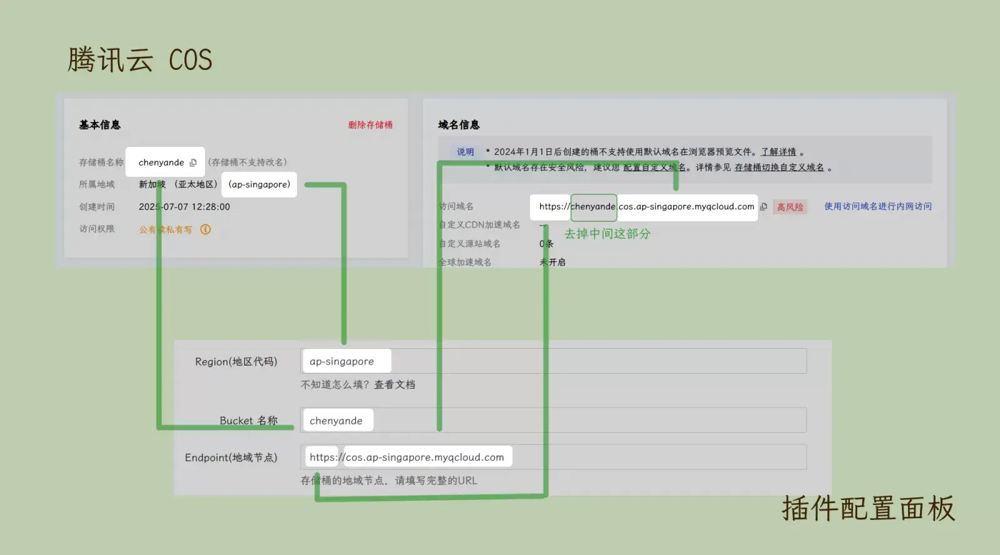

# 腾讯云COS存储配置

- [官方网站](https://curl.qcloud.com/EUd4Xp2x)
- [定价说明](https://curl.qcloud.com/6zXLdsJd)

## 配置信息

1. 前往 [COS控制台](https://curl.qcloud.com/tPoI2o1J) 创建一个存储桶
2. `Region` 填写 所属地域括号里的英文部分
3. `Bucket` 填写 存储桶名称
4. `Endpoint` 填写 访问域名 并去掉头部的存储桶名称
 
5. 前往 [访问密钥 - 控制台](https://curl.qcloud.com/svYftakQ) 获取密钥，将`SecretId`填入`Access Key`，将`SecretKey`填入`Secret Key`

