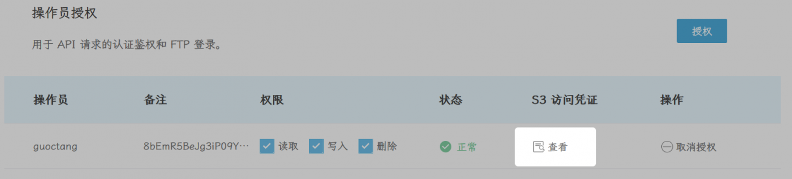

# 又拍云 USS

## 設定情報
1. 登録 [又拍云へ登録](https://console.upyun.com/register/?invite=qjG-JJP1q)し、ストレージボトルを1つ作成します

2. ボトルの名前を`Bucket`に入力します
3. `Endpoint`に`"https://s3.api.upyun.com"`を入力します
4. `Region`に`"us-east-1"`を入力します
5. ストレージ管理——操作員権限を下拉します——S3 凭证将`AccessKey`と`SecretAccessKey`を`Access Key`と`Secret Key`に入力します

