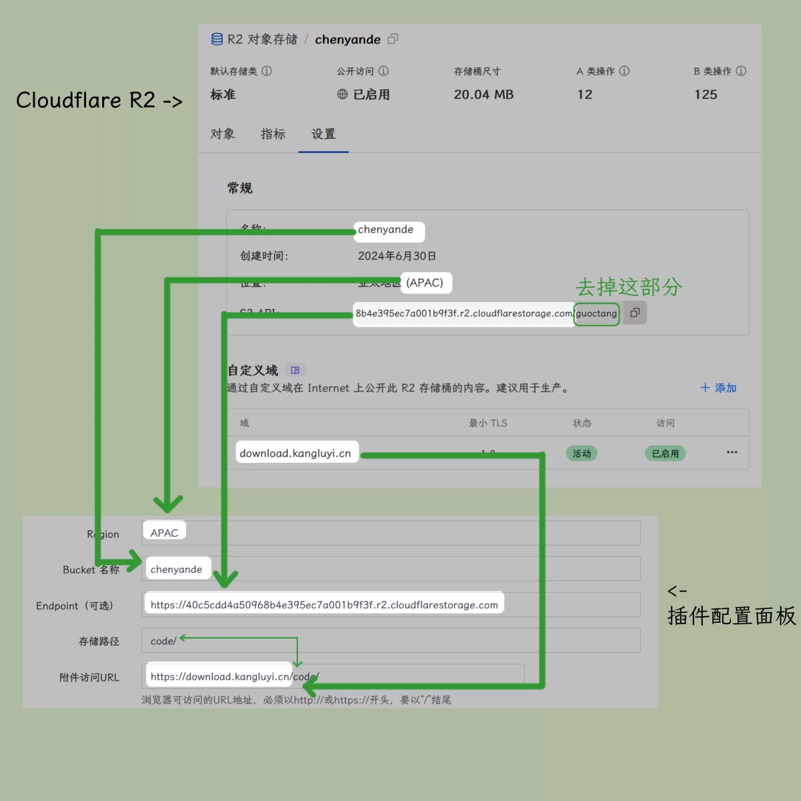

# Cloudflare RR
## 設置資料
1. 首先去[Cloudflare](https://www.cloudflare.com/developer-platform/products/r/Cloudflare) 創建一個存儲桶
2. 填寫 Access Key 和 Secret Key

3. 「Region」 填寫位置括號里的英文部分
4. 「Bucket」 填寫創建存儲桶時填寫的「存儲桶名称」
5. 「Endpoint」 填寫「S3 API」並去掉結尾的存儲桶名称
6. 「存儲路路径」 填寫文件的存儲位置（默認為根目錄）

